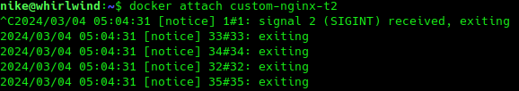
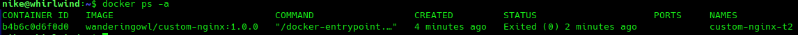
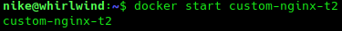
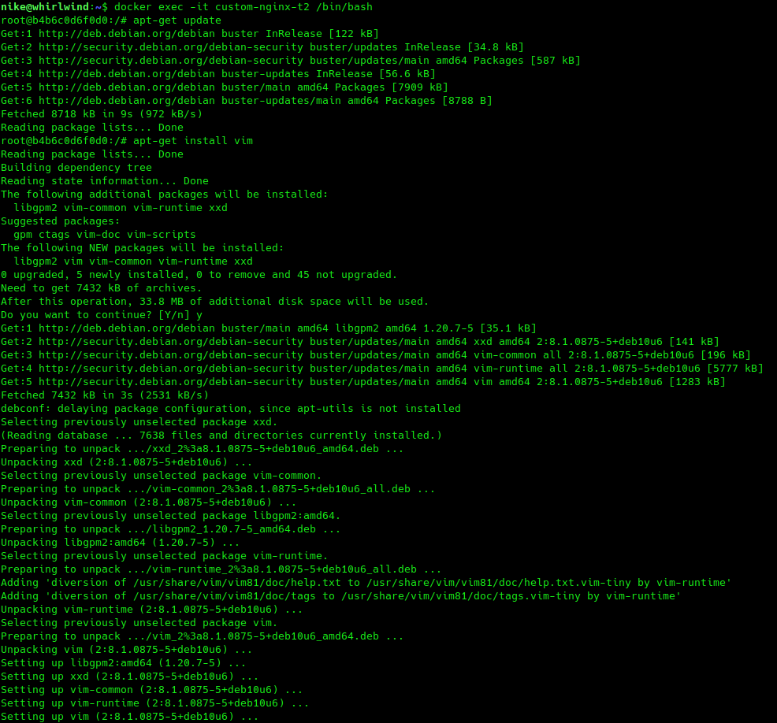
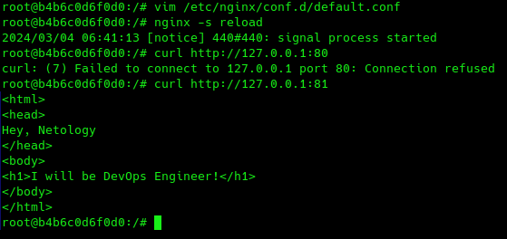
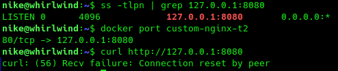
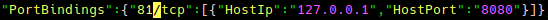
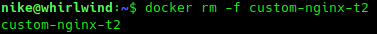

1. Воспользуйтесь docker help или google, чтобы узнать как подключиться к стандартному потоку ввода/вывода/ошибок контейнера "custom-nginx-t2".
2. Подключитесь к контейнеру и нажмите комбинацию Ctrl-C.



4. Выполните ```docker ps -a``` и объясните своими словами почему контейнер остановился.



  Контейнер остановился из-за того, что мы запускаем его в неинтерактивном режиме. Контейнеру передаётся сигнал SIGINT и завершает его процесс. 

6. Перезапустите контейнер



7. Зайдите в интерактивный терминал контейнера "custom-nginx-t2" с оболочкой bash.
8. Установите любимый текстовый редактор(vim, nano итд) с помощью apt-get.



9. Отредактируйте файл "/etc/nginx/conf.d/default.conf", заменив порт "listen 80" на "listen 81".
10. Запомните(!) и выполните команду ```nginx -s reload```, а затем внутри контейнера ```curl http://127.0.0.1:80 ; curl http://127.0.0.1:81```.



11. Выйдите из контейнера, набрав в консоли  ```exit``` или Ctrl-D.
12. Проверьте вывод команд: ```ss -tlpn | grep 127.0.0.1:8080``` , ```docker port custom-nginx-t2```, ```curl http://127.0.0.1:8080```. Кратко объясните суть возникшей проблемы.



Проблема в том, что конфигурация запуска контейнера осталась старой.

13. * Это дополнительное, необязательное задание. Попробуйте самостоятельно исправить конфигурацию контейнера, используя доступные источники в интернете. Не изменяйте конфигурацию nginx и не удаляйте контейнер. Останавливать контейнер можно. [пример источника](https://www.baeldung.com/linux/assign-port-docker-container)

Нужно остановить контейнер , отредактировать файл ```/var/lib/docker/containers/< ID контейнера >/hostconfig.json``` и поменять параметр как на скриншоте:



После чего перезапустить сервис докера командой ```sudo systemctl docker restart``` и далее запустить контейнер.


14. Удалите запущенный контейнер "custom-nginx-t2", не останавливая его.(воспользуйтесь --help или google)


